# SPARQL<sub>circ</sub>: Probabilistic Query Answering with Provenance Circuits

[](LICENSE)


**Exact probabilistic query evaluation on unmodified RDF engines through
shared provenance circuits.**

Given a SELECT query over occurrence-reified RDF, SPARQLcirc generates a plan
of CONSTRUCT queries that a stock endpoint can execute. The plan materializes
one shared, content-addressed RDF DAG for all answers: uncertain input
occurrences are leaves, while internal ⊕, ⊗, and ⊖ gates represent
disjunction, conjunction, and Boolean difference. The client parses this DAG,
compiles its answer roots with CUDD or d4, and computes exact probabilities by
weighted model counting (WMC).

The workflow is divided deliberately between an unmodified endpoint and the
client-side exact-PQE pipeline:

```mermaid
flowchart LR
    Q["SELECT query<br/>over occurrence-reified RDF"]:::io

    subgraph EN["unmodified RDF/SPARQL endpoint"]
        direction TB
        C["executes the generated<br/>CONSTRUCT plan"]:::step
        G["shared provenance circuit<br/>⊕ ⊗ ⊖ gates<br/>content-addressed RDF"]:::hero
        C --> G
    end

    subgraph CL["client-side exact PQE"]
        direction TB
        K["knowledge compilation<br/>CUDD · d4"]:::step
        W["weighted model counting"]:::step
        K --> W
    end

    P["exact answer probabilities<br/>one per SELECT row"]:::io

    Q -->|"SPARQLcirc rewrite"| C
    G -->|"streamed RDF graph"| K
    W --> P

    classDef io fill:transparent,stroke:#6366f1,stroke-width:1.5px
    classDef step fill:transparent,stroke:#94a3b8
    classDef hero fill:transparent,stroke:#2563eb,stroke-width:3px
    style CL fill:transparent,stroke:#94a3b8,stroke-dasharray:4 4
    style EN fill:transparent,stroke:#ca8a04,stroke-width:2px,stroke-dasharray:4 4
```



The endpoint evaluates RDF queries and does not need a probabilistic extension;
circuit parsing, compilation, and WMC remain client-side. Content-addressed
gate IRIs make equal subcircuits identical across derivations and answer roots,
so RDF set semantics removes duplicate gate triples automatically. In contrast
to per-answer provenance strings, shared subcircuits are represented once and
referenced by every answer that uses them.

## Supported fragment

- basic graph patterns, joins, and UNION;
- OPTIONAL and MINUS through Boolean difference gates;
- FILTER and deterministic BIND expressions in the tested fragment;
- DISTINCT;
- property paths over `+`, `*`, `/`, `|`, and `^` in the path
  pipeline.

The current scope is one default ABox graph. Aggregation, GROUP BY, HAVING,
SERVICE, named-graph semantics, correlated subqueries, and update queries are
outside the supported fragment. Unsupported forms are rejected rather than
approximated.

Two BGP construction plans are available:

- `flat` materializes one product for each complete derivation;
- `factorised` applies variable elimination and materialized intermediate
  relations when the query shape permits it, and records an explicit fallback
  when it does not.

Property paths use a separate fixpoint plan. A factorised plan can require a
writable update endpoint for private intermediate relations; `flat` remains
the read-only route.

## Reification schemes

The Java CLI accepts:

- `Standard` and `SPARQL_Star` for mixed asserted-triple plus occurrence
  data;
- `Standard_Pure` and `SPARQL_Star_Pure` for historical token-only
  fixtures;
- `SPARQL_Star_Row` for row-shaped TPC-H RDF.

`SPARQL_Star_Row` groups all triple patterns for the same row subject and
uses the occurrence attached to that row's type assertion. One uncertain
relational tuple is therefore one probabilistic event; its attribute columns
are not treated as independent facts.

## Requirements and installation

Core requirements:

- Java 11 or newer;
- Maven 3.6 or newer;
- Python 3.9 or newer;
- Python 3.11 for the native CUDD production path.

Build the Java rewriter and run the dependency-free reference checks:

```bash
mvn -q -f engine/pom.xml package
python reference/tests.py
```

The Maven build creates `engine/target/npcs-rewrite.jar` and runs the JUnit
suite. Install the independent rdflib oracle and run the fresh Java-to-WMC
smoke test:

```bash
python -m pip install -r reference/requirements-optional.txt
python reference/quick_verify.py
```

Expected final output is `QUICK VERIFY ALL OK`. For production CUDD:

```bash
python -m pip install -r reference/requirements-production.txt
python reference/verify_compiler.py --require-cudd
```

d4/d4v2 is optional and runs on Linux/x86:

```bash
git clone https://github.com/crillab/d4v2
cd d4v2
./build.sh
```

Set the resulting executable path in the experiment environment. d4 is an
evaluation compiler; CUDD is the normal production backend.

## Minimal end-to-end example

```bash
java -jar engine/target/npcs-rewrite.jar circuit \
  Standard \
  reference/data/drug.reified.ttl \
  reference/queries/drug3hop.sparql \
  > circuit.nt

python reference/pqe.py \
  --circuit circuit.nt \
  --probabilities reference/data/drug.probabilities.json
```

Append a SPARQL query endpoint URL to the Java command to construct the circuit
on a deployed engine. The user-facing Python command can also construct and
evaluate in one invocation:

```bash
python reference/pqe.py \
  --jar engine/target/npcs-rewrite.jar \
  --data reference/data/drug.reified.ttl \
  --query reference/queries/drug3hop.sparql \
  --probabilities reference/data/drug.probabilities.json
```

## External software and data

Large datasets, licensed generators, GraphDB installations, database files,
credentials, raw endpoint responses, and scheduler logs are intentionally not
stored in Git.

### RDF engines

The formal figures use GraphDB and, where stated, Oxigraph or Fuseki. Download
GraphDB from the [official GraphDB product page](https://graphwise.ai/components/graphdb/)
and start its standalone server. The default Workbench and RDF4J endpoint are
on `http://localhost:7200/`.

Create two repositories for RDF experiments:

- a base repository containing asserted/direct triples;
- a mixed repository containing the same asserted triples plus occurrence
  statements.

Load data through Workbench, RDF4J HTTP, or GraphDB's import tool. Use a
separate update endpoint for factorised intermediate relations.

### WatDiv 0.6

Download the source, official test suite, or prepared datasets from the
[University of Waterloo WatDiv page](https://dsg.uwaterloo.ca/watdiv/index.shtml).
Build the C++ generator with Boost and a Unix word list available under
`/usr/share/dict`.

Generate a deduplicated base graph and RDF-star 1.1 mixed layout:

```bash
python reference/watdiv/prepare_data.py generate \
  --watdiv /opt/watdiv/watdiv \
  --model /opt/watdiv/model/wsdbm-data-model.txt \
  --scale 1 \
  --out /data/watdiv/sf1

python reference/watdiv/prepare_data.py audit \
  /data/watdiv/sf1/dataset.json
```

The formal query freezer needs the matching model, `saved.txt`, and official
WatDiv test-suite directory:

```bash
python reference/paper/watdiv10m_workload.py generate \
  --watdiv /opt/watdiv/watdiv \
  --model /opt/watdiv/model/wsdbm-data-model.txt \
  --state /data/watdiv/sf1/saved.txt \
  --official-testsuite /opt/watdiv/testsuite \
  --dataset-id watdiv-10m \
  --out /data/watdiv/workload-10m

python reference/paper/watdiv10m_workload.py audit \
  /data/watdiv/workload-10m
```

The same data preparer accepts `--scale 10` for a WatDiv 100M store. The
frozen workload manifest and Figure 3 runner are deliberately scoped to 10M;
the repository does not present the earlier 100M exploratory runs as a
completed formal matrix.

Workload provenance:

- L1-L5, S1-S7, F1-F5, and C1-C3 are the official WatDiv 0.6 suite;
- O1-O5 are reconstructed generator templates for the SPARQLprov OPTIONAL
  extensions;
- M1-M5 and the P property-path family are project-authored extensions;
- all O/M/P template inputs are checked in under
  `reference/paper/workload_templates/watdiv10m/`.

### TPC-H 3.0.1

Obtain TPC-H 3.0.1 `dbgen` and `qgen` from the
[TPC current specifications and tools page](https://www.tpc.org/tpc_documents_current_versions/current_specifications5.asp).
TPC requires accepting its license and registering for a temporary download.
Build the tools outside this repository.

The formal sweep uses exactly nine scale factors:

```text
SF_i = 10^(i/4 - 2), i = 0, ..., 8
```

or approximately `0.01, 0.0178, 0.0316, 0.0562, 0.1, 0.1778, 0.3162,
0.5623, 1`. Prepare each scale:

```bash
python reference/tpch/prepare_data.py generate \
  --dbgen /opt/tpch/dbgen \
  --dbgen-dir /opt/tpch \
  --scale 0.1 \
  --tpch-version 3.0.1 \
  --out /data/tpch/sf0p1

python reference/tpch/prepare_data.py audit \
  /data/tpch/sf0p1/dataset.json
```

The output contains the `.tbl` files, `base.nt`,
`mixed-rdfstar11.ttls`, generator logs, and `dataset.json`.

Freeze the 12 non-aggregate query templates with qgen parameters. The released
SPARQLprov templates are available from the
[SPARQLprov artifact page](https://relweb.cs.aau.dk/sparqlprov/):

```bash
python reference/tpch/workload.py generate \
  --qgen /opt/tpch/qgen \
  --dbgen-dir /opt/tpch \
  --sparqlprov-templates /opt/SPARQLprov/tpch/sparql_examples \
  --out /data/tpch/workload
```

The workload contains Q1, Q3-Q8, Q10, Q12, Q14, Q15, and Q19. Q9 is not part
of the formal matrix. Ten shapes follow the SPARQLprov non-aggregate workload;
Q4 and Q15 are documented non-aggregate adaptations. The aligned SQL templates
used by ProvSQL are checked in under
`reference/tpch/templates/provsql_non_aggregate/`.

### Wikidata 141-query workload

Download the official Wikidata truthy N-Triples dump:

```bash
wget -c https://dumps.wikimedia.org/wikidatawiki/entities/20260819/wikidata-20260819-truthy-BETA.nt.bz2
```

Prepare direct triples and RDF-star 1.1 occurrences from that frozen dump:

```bash
python reference/wdbench/prepare_rdfstar11.py \
  --input wikidata-20260819-truthy-BETA.nt.bz2 \
  --direct-out /data/wikidata/direct.nt \
  --occurrences-out /data/wikidata/occurrences.ttls \
  --metadata /data/wikidata/dataset.json \
  --source-url https://dumps.wikimedia.org/wikidatawiki/entities/20260819/wikidata-20260819-truthy-BETA.nt.bz2 \
  --bnode-base urn:wdbench:skolem:20260819:
```

Load `direct.nt` into the base repository. Load both `direct.nt` and
`occurrences.ttls` into the mixed repository, then validate them:

```bash
python reference/wdbench/validate_stores.py \
  --metadata /data/wikidata/dataset.json \
  --base-endpoint http://127.0.0.1:7200/repositories/wikidata-base \
  --mixed-endpoint http://127.0.0.1:7200/repositories/wikidata-mixed \
  --out /data/wikidata/store-validation.json
```

The evaluated workload contains 141 queries:

- `reference/wdbench/workloads/npcs-public-136/` contains the unaltered public
  NPCS Basic workload: 49 single-BGP, 37 multi-BGP, and 50 OPTIONAL queries;
- `reference/wdbench/workloads/wdbench-property-paths-5/` contains five frozen
  recursive property-path queries selected from WDBench, including each
  published source fragment, its single-variable base query, and the
  semantically equivalent source-bounded SPARQLcirc query;
- `reference/wdbench/workloads/wikidata-141/manifest.json` is the unified
  per-query manifest used by the experiment scripts.

The five WDBench queries are included as a property-path supplement to the public
NPCS Wikidata workload; they are not presented as part of the NPCS release.
The Basic queries come from the
[NPCS repository](https://github.com/ZubariaForthAcc/NPCS), and the supplement
comes from `Queries/paths.txt` in the
[WDBench repository](https://github.com/MillenniumDB/WDBench). Regenerate the
single experiment manifest with:

```bash
python reference/wdbench/workloads/wdbench-property-paths-5/build_manifest.py \
  --wdbench /opt/WDBench
python reference/wdbench/workloads/wikidata-141/build_manifest.py
```

Passing `--wdbench /opt/WDBench` verifies that all five frozen source fragments
match `Queries/paths.txt`. The path queries were selected by an exact-count
screening step; screening times
are not reused as formal measurements.

## Formal experiments

Formal endpoint work must run on compute allocations, not login nodes. Freeze
the source, input manifest, engine version, heap, CPU policy, query protocol,
warm-cache policy, timeout, and process-tree RSS settings before the first
warm-up.

Unless a command explicitly states otherwise, every formal method cell uses
one warm-up followed by five measured executions. Query-level runtime is the
median of the five successful measured executions. A failed execution is kept
as its actual status and is never replaced by the timeout value.

Formal PQE uses seed `42`. Each canonical event IRI is mapped
independently to a reproducible pseudorandom probability in `(0,1)`, so the
same event receives the same value in SPARQLcirc, CUDD, d4, and ProvSQL while
different events do not all share one fixed probability.

Install the Python or R plotting environment only when turning a newly
summarized result root into figures:

```bash
python -m pip install -r presentation/figures/paper/requirements.txt
conda env create -f presentation/figures/paper/environment-r.yml
conda activate sparqlcirc-paper-figures
```

### WatDiv and Wikidata method cells

`reference/paper/watdiv10m_runner.py` runs B, reified-query, NPCS, C-flat,
C-factorised, and C-path cells. A representative C cell is:

```bash
python reference/paper/watdiv10m_runner.py \
  --query /data/watdiv/workload-10m/queries/nonpath/L1/00.rq \
  --query-id L1-00 \
  --engine graphdb-10.7.6 \
  --method C-factorised \
  --scheme SPARQL_Star \
  --out /results/L1/C-factorised \
  --base-endpoint http://127.0.0.1:7200/repositories/base \
  --reified-endpoint http://127.0.0.1:7200/repositories/mixed \
  --update-endpoint http://127.0.0.1:7200/repositories/mixed/statements \
  --jar engine/target/npcs-rewrite.jar \
  --warmups 1 --runs 5 --primary-statistic median \
  --endpoint-timeout 600 --offline-timeout 600 \
  --pqe-backend none
```

Figure 3 uses instances `00`, `01`, and `02` from every ordinary template and
from P-plus/P-star. Run one engine per immutable result root; repeat the command
for Fuseki and Oxigraph with their endpoint and engine identifiers:

```bash
python reference/paper/watdiv10m_batch.py \
  --workload /data/watdiv/workload-10m \
  --dataset /data/watdiv/sf1/dataset.json \
  --engine graphdb-10.7.6 \
  --out /results/watdiv10m/graphdb \
  --base-endpoint http://127.0.0.1:7200/repositories/base \
  --mixed-endpoint http://127.0.0.1:7200/repositories/mixed \
  --update-endpoint http://127.0.0.1:7200/repositories/mixed/statements \
  --jar engine/target/npcs-rewrite.jar \
  --continue-after-failure

python reference/paper/watdiv10m_summarize.py \
  --workload /data/watdiv/workload-10m \
  --cells /results/watdiv10m/graphdb \
  --cells /results/watdiv10m/fuseki \
  --cells /results/watdiv10m/oxigraph \
  --json /results/watdiv10m/figure3-summary.json \
  --csv /results/watdiv10m/endpoint_plot_data.csv

python presentation/figures/paper/watdiv10m/plot_figure3.py \
  --data /results/watdiv10m/endpoint_plot_data.csv \
  --out /results/watdiv10m/figure3
```

The batch expands to 462 physical cells per engine: 30 ordinary templates ×
three instances × five methods, plus two path templates × three instances ×
two methods. Non-timeout infrastructure failures prevent publication-table
generation rather than being rendered as timeouts.

NPCS large responses use `--response-mode stream-tsv`. SPARQLcirc keeps RDF
CONSTRUCT output and handles it as a stream; it is not changed to TSV.

For NPCS-public-136, the two NPCS post-processing modes share one endpoint
response:

- per-answer parsing and hash-consing;
- query-global shared hash-consing.

C cells record requested plan, effective plan, fallback reason, and streaming
result handling.

The five property-path queries are a C-only supplement because the released NPCS
and SPARQLprov rewriters have no recursive property-path provenance rule. Pure
recursive paths use SPARQLcirc's dedicated fixpoint plan; requested flat and
factorised labels therefore do not imply different path-core algorithms unless
the recorded effective plan says so. Unsupported baseline path cells are not
reported as failures.

For the unified Wikidata workload, run one immutable shard per command and then
summarize the selected shard roots:

```bash
python reference/wdbench/run_shard.py \
  --manifest reference/wdbench/workloads/wikidata-141/manifest.json \
  --shard-index 0 \
  --result-root /results/wikidata/shard-0 \
  --source-root "$PWD" \
  --session-id graphdb-session-001 \
  --graphdb-pid "$GRAPHDB_PID" \
  --mixed-endpoint http://127.0.0.1:7200/repositories/wikidata-mixed \
  --update-endpoint http://127.0.0.1:7200/repositories/wikidata-mixed/statements \
  --jar engine/target/npcs-rewrite.jar \
  --java java \
  --reified-data /data/wikidata/occurrences.ttls \
  --warmups 1 --runs 5 --timeout 600

python reference/wdbench/summarize.py \
  --manifest reference/wdbench/workloads/wikidata-141/manifest.json \
  --cells /results/wikidata/shard-0 \
  --cells /results/wikidata/shard-1 \
  --cells /results/wikidata/shard-2 \
  --json /results/wikidata/summary.json \
  --csv /results/wikidata/summary.csv
```

Repeat the shard command with indices 1 and 2. Each NPCS physical cell executes
one endpoint query and sends the same immutable TSV stream to the per-answer
and query-shared post-processing branches. C cells retain RDF CONSTRUCT output
and stream it into the circuit artifact. The unified workload expands to 549
logical method rows: 136 Basic queries with four methods, plus five path
queries with C-path.

Run CUDD and per-answer d4 over the successful C artifacts. Repeat each command
for shard indices 1 and 2; the d4 path deliberately invokes d4 once per answer
root while CUDD compiles the query's roots in one shared manager:

```bash
python reference/wdbench/run_pqe_batch.py \
  --manifest reference/wdbench/workloads/wikidata-141/manifest.json \
  --construction-cells /results/wikidata/shard-0 \
  --source-root "$PWD" \
  --out /results/wikidata/pqe-cudd-shard-0 \
  --backend cudd --shard-index 0 --probability-seed 42 \
  --continue-after-failure

python reference/wdbench/run_pqe_batch.py \
  --manifest reference/wdbench/workloads/wikidata-141/manifest.json \
  --construction-cells /results/wikidata/shard-0 \
  --source-root "$PWD" \
  --out /results/wikidata/pqe-d4-shard-0 \
  --backend d4 --d4 /opt/d4v2/d4 \
  --shard-index 0 --probability-seed 42 \
  --continue-after-failure
```

Build the Figure 4-6 inputs and images directly from the immutable cells:

```bash
python reference/wdbench/derive_counts.py \
  --source-root "$PWD" \
  --manifest reference/wdbench/workloads/wikidata-141/manifest.json \
  --cells /results/wikidata/shard-0 \
  --cells /results/wikidata/shard-1 \
  --cells /results/wikidata/shard-2 \
  --out /results/wikidata/derivations.csv

python presentation/figures/paper/wikidata_scatter/build_plot_data.py \
  --construction-summary /results/wikidata/summary.json \
  --derivations /results/wikidata/derivations.csv \
  --out /results/wikidata/scatter-data

python reference/wdbench/summarize_pqe.py \
  --manifest reference/wdbench/workloads/wikidata-141/manifest.json \
  --cells /results/wikidata/pqe-cudd-shard-0 \
  --cells /results/wikidata/pqe-cudd-shard-1 \
  --cells /results/wikidata/pqe-cudd-shard-2 \
  --cells /results/wikidata/pqe-d4-shard-0 \
  --cells /results/wikidata/pqe-d4-shard-1 \
  --cells /results/wikidata/pqe-d4-shard-2 \
  --out /results/wikidata/query_stage_times.csv

python presentation/figures/paper/wikidata_scatter/plot_figures4_5.py \
  --data /results/wikidata/scatter-data \
  --out /results/wikidata/figures4-5

Rscript presentation/figures/paper/wikidata_overhead/plot_figure6.R \
  /results/wikidata/figure6 \
  /results/wikidata/query_stage_times.csv
```

### TPC-H RDF track

TPC-H uses `SPARQL_Star_Row`, one warm-up plus five measured executions, and a
single 3,000-second complete-method deadline shared by plan generation,
CONSTRUCT execution, streamed circuit receipt, parsing, and requested PQE:

```bash
python reference/tpch/run_batch.py \
  --manifest /data/tpch/workload/manifest.json \
  --dataset /data/tpch/sf0p1/dataset.json \
  --scale 0.1 \
  --engine graphdb-10.7.6 \
  --out /results/tpch/rdf/graphdb/sf0p1 \
  --base-endpoint http://127.0.0.1:7200/repositories/tpch-base \
  --mixed-endpoint http://127.0.0.1:7200/repositories/tpch-mixed \
  --update-endpoint http://127.0.0.1:7200/repositories/tpch-mixed/statements \
  --jar engine/target/npcs-rewrite.jar \
  --method C-flat --method C-factorised \
  --warmups 1 --runs 5 \
  --complete-method-timeout 3000 \
  --pqe-backend cudd \
  --probability-seed 42
```

Repeat this batch for all nine prepared scales on GraphDB and Oxigraph, using
one result root per engine and scale.

### TPC-H PostgreSQL/ProvSQL track

Install PostgreSQL and
[ProvSQL](https://github.com/PierreSenellart/provsql), derive the aligned SQL
workload, and load each prepared scale:

```bash
python reference/tpch/provsql_workload.py generate \
  --manifest /data/tpch/workload/manifest.json \
  --instance q001 \
  --out /data/tpch/provsql-workload

python reference/tpch/provsql_prepare.py \
  --dataset /data/tpch/sf0p1/dataset.json \
  --out /results/tpch/provsql/prepare-sf0p1 \
  --schema reference/tpch/provsql_schema.sql \
  --probability-seed 42 \
  --psql psql --dsn postgresql:///tpch
```

Run the ProvSQL cells for each prepared scale:

```bash
python reference/tpch/provsql_run.py \
  --manifest /data/tpch/provsql-workload/manifest.json \
  --dataset /data/tpch/sf0p1/dataset.json \
  --scale 0.1 \
  --out /results/tpch/provsql/sf0p1 \
  --psql psql --dsn postgresql:///tpch \
  --method ProvSQL \
  --warmups 1 --runs 5 \
  --measured-total-timeout 3000
```

The relational and RDF tracks use the same TPC-H rows and qgen parameters.
ProvSQL assigns one token per tuple; SPARQLcirc assigns one token per row type
assertion. Both tracks derive each probability from the same row IRI and fixed
seed. The SQL answer query groups every projected column so each distinct
answer binding has one provenance root.

### TPC-H summaries

```bash
python reference/tpch/summarize.py \
  --manifest /data/tpch/workload/manifest.json \
  --cells /results/tpch/rdf/graphdb \
  --cells /results/tpch/rdf/oxigraph \
  --engine graphdb --engine oxigraph \
  --method C-flat --method C-factorised \
  --json /results/tpch/rdf/summary.json \
  --csv /results/tpch/rdf/summary.csv

python reference/tpch/provsql_summarize.py \
  --manifest /data/tpch/provsql-workload/manifest.json \
  --cells /results/tpch/provsql \
  --method ProvSQL \
  --json /results/tpch/provsql/summary.json \
  --csv /results/tpch/provsql/summary.csv

python reference/tpch/build_figure7_data.py \
  --rdf-summary /results/tpch/rdf/summary.csv \
  --provsql-summary /results/tpch/provsql/summary.csv \
  --out /results/tpch/figure7/measured_full_pipeline.csv

Rscript presentation/figures/paper/tpch_scaling/plot_figure7.R \
  /results/tpch/figure7 \
  /results/tpch/figure7/measured_full_pipeline.csv
```

The Figure 7 builder requires the complete 12-panel matrix, all nine scale
factors, and all five system/mode series: GraphDB flat/factored, Oxigraph
flat/factored, and PostgreSQL/ProvSQL. Failed and timed-out cells appear as
gaps.

## Repository layout

```text
engine/src/main/java/npcs/       Java rewrite and circuit execution
engine/src/test/java/            Java semantic and regression tests
engine/examples/                 small runnable query examples
reference/                       Python circuits, compilers, WMC, experiments
reference/paper/                 frozen workloads and formal runner tests
reference/tpch/                  TPC-H data, query, RDF, SQL, and runner tools
reference/wdbench/               Wikidata preparation and frozen workloads
presentation/figures/paper/      plotting code and reproducible environments
```

Generated result tables, manifests, PDFs, and PNGs stay in external result
roots and are not tracked. Use `--help` on every generator, runner, summarizer,
and Python plotter for the complete CLI.

## Correctness and CI

CI runs:

- the Python possible-world correctness battery on Python 3.9 and 3.12;
- native CUDD shared/per-root checks on Python 3.11;
- TPC-H row mapping, workload, RDF runner, ProvSQL runner, summary, and figure
  table regressions;
- WatDiv workload and B/R/N/C runner regressions;
- deterministic NPCS-public-136 and WDBench property-path-5 workload checks;
- a clean Maven build, deep composition sweeps, and a fresh Java-to-WMC path.

Useful focused commands:

```bash
python reference/verify_nonmono.py
python reference/verify_gallery.py
python reference/verify_differential.py --skip-engine
python -m unittest \
  reference.paper.test_tpch_run_batch \
  reference.paper.test_tpch_summarize \
  reference.paper.test_tpch_figure7_data \
  reference.paper.test_tpch_provsql_workload \
  reference.paper.test_tpch_provsql_run
```

## Experiment artifact policy

Completed result roots are immutable. A retry uses a separate root and records
the original cell key, failure class, protocol, account, and scheduler job. The
original summary and final overlay are both retained, with
a machine-readable replacement decision for every retry.

Timeout, OOM, endpoint HTTP failure, transport failure, parser failure,
permission failure, and scheduler failure are distinct statuses. A collector
dependency controls when collection starts but does not add retry roots to its
input list; a finalizer must explicitly include both original and accepted
retry results.

## License and attribution

SPARQLcirc is available under Apache License 2.0. WatDiv, TPC-H, Wikidata,
GraphDB, NPCS, SPARQLprov, ProvSQL, CUDD, and d4 retain their own licenses and
terms.
