# SPARQLcirc: Native-SPARQL Provenance Circuits for Exact Probabilistic Query Evaluation

[](https://github.com/0sidewalkenforcer0/SPARQLcirc/actions/workflows/ci.yml)
[](LICENSE)


**Native probabilistic query evaluation for SPARQL via compiled provenance circuits**

SPARQLcirc rewrites a SPARQL query so that an **unmodified** SPARQL engine, when it runs the
rewritten query, materializes a single **shared, content-addressed provenance circuit**: an RDF DAG
of ⊕ (union), ⊗ (join), and ⊖ (difference / OPTIONAL / MINUS) gates that represents the provenance
of *all* answers at once. The circuit is then compiled (OBDD / SDD / d-DNNF) and
**weighted-model-counted** for *exact* probabilistic query evaluation. This contrasts with NPCS /
SPARQLprov, which serialize each answer's provenance as a **string** (shared subterms repeated, size
growing with the number of derivations), and with ProvSQL, which requires a **modified** database
engine. Here the engine is stock, and the circuit is a normal RDF graph, so RDF set semantics
deduplicates shared gates automatically.

```mermaid
flowchart LR
    Q["SPARQL query<br/>over a probabilistic ABox"]:::io

    subgraph EN["unmodified SPARQL 1.1 engine"]
        direction TB
        C["runs a plain CONSTRUCT"]:::step
        G["shared provenance circuit<br/>⊕ ⊗ ⊖ gates<br/>content-addressed RDF"]:::hero
        C --> G
    end

    subgraph CL["client"]
        direction TB
        K["knowledge compilation<br/>OBDD · SDD · d-DNNF"]:::step
        W["weighted model counting"]:::step
        K --> W
    end

    P["exact answer probabilities<br/>one per SELECT row"]:::io

    Q -->|"γ rewrite"| C
    G -->|"an ordinary RDF graph"| K
    W --> P

    classDef io fill:transparent,stroke:#6366f1,stroke-width:1.5px
    classDef step fill:transparent,stroke:#94a3b8
    classDef hero fill:transparent,stroke:#2563eb,stroke-width:3px
    style CL fill:transparent,stroke:#94a3b8,stroke-dasharray:4 4
    style EN fill:transparent,stroke:#ca8a04,stroke-width:2px,stroke-dasharray:4 4
```



### What has been measured

- **Exact, not approximate.** 171/171 answer probabilities match brute-force possible-world
  enumeration, and on the *real* WatDiv / TPC-H / Wikidata circuits the compiled WMC matches
  enumeration on every sampled answer — enumeration uses no compilation and no variable order, so the
  numbers do not depend on the compiler.
- **The circuit is a property of the rewriting, not of one engine.** GraphDB, Oxigraph, QLever and
  MillenniumDB — Java, Rust and two C++ codebases — emit the **byte-identical** content-addressed
  circuit, at both 10M and 100M.
- **It runs at knowledge-graph scale on stock software.** A circuit over reified WatDiv 100M
  (327M triples), and a property path over a **2.13-billion-triple** Wikidata graph with a 161 MB
  client footprint, because the client only ever sees the reachable subgraph.
- **Against the closest baseline, the same probabilities without forking the database.** Exact parity
  with ProvSQL (a modified PostgreSQL) on TPC-H. The shared circuit's size and compile advantage over
  per-answer provenance strings is **co-extensive with reconvergence**: up to 201× on recursive
  workloads, and ≤ 1× on tree-shaped joins, which we state rather than average away.

Details and caveats: [reference/RESULTS.md](reference/RESULTS.md) ·
[reference/CANONICAL_TIMINGS.md](reference/CANONICAL_TIMINGS.md).

### Scope and limits

ABox only (no TBox), one default graph. Engine-side property paths are `+`/`*` over a single
predicate with an IRI frontier; the Python reference covers every path operator. Anything the
rewriting cannot answer **exactly** is [rejected with a loud error](#rejected-loud-error-never-mis-answered)
rather than silently mis-answered. This is a research prototype: the correctness gates are CI-enforced,
the operational polish is not.

---

## Requirements

| Requirement | Version | Check Command |
|-------------|---------|---------------|
| Java (JDK)  | **11 or higher** | `java -version` |
| Maven       | **3.6 or higher** | `mvn -version` |
| Python (core: circuit, ROBDD oracle, WMC, benchmarks) | **3.9 or higher**, standard library only | `python3 --version` |
| Python (`quick_verify.py`) | the above **plus rdflib** — see Optional Components | `python3 -c "import rdflib"` |
| Python (production CUDD compile and WMC) | **3.11 or higher** | `python3 --version` |

### Optional Components

| Component | Needed for | How to obtain |
|-----------|------------|---------------|
| rdflib | `quick_verify.py`'s composition differential — it is the *independent* oracle for the FILTER cases, so a missing rdflib fails the check rather than skipping it | `pip install "rdflib>=6.3,<8"` |
| CUDD (`dd==0.6.0`) | production BDD compilation and batch WMC | `pip install -r reference/requirements-production.txt` |
| PySDD | SDD compilation baseline | `pip install pysdd` |
| d4 | d-DNNF compilation baseline (Linux/x86 only) | see [reference/D4_ON_LINUX.md](reference/D4_ON_LINUX.md) |
| GraphDB 10.x | deployed-engine timings and real-KG runs | https://graphdb.ontotext.com/ (free edition, JDK 11+, port 7200) |
| WatDiv / TPC-H / Wikidata data | the scaling and baseline experiments | **not bundled** — see [Data Acquisition](#data-acquisition) for where each comes from and how to prepare it |

Any SPARQL 1.1 endpoint that accepts `CONSTRUCT` works in place of GraphDB. The circuit
construction uses no engine-specific features.

### Installing Java 11 (if needed)

**macOS (Homebrew):**
```bash
brew install --cask temurin@11
```

**Ubuntu/Debian:**
```bash
sudo apt install openjdk-11-jdk
```

**Windows:**
Download from [Adoptium](https://adoptium.net/temurin/releases/?version=11)

---

## Installation

### Step 1: Clone the Repository

```bash
git clone https://github.com/0sidewalkenforcer0/SPARQLcirc.git
cd SPARQLcirc
```

### Step 2: Build the Rewriter

```bash
mvn -q -f engine/pom.xml package
```

This produces `engine/target/npcs-rewrite.jar`, a self-contained fat JAR whose `Main-Class` is the
`npcs.App` dispatcher. Runtime dependencies are Eclipse RDF4J 4.2.1 and SLF4J, fetched from Maven
Central; JUnit is used only for tests.

**Expected output:**
```
[INFO] BUILD SUCCESS
```

> ⏱️ **Note:** the first build downloads the RDF4J dependency tree and takes a few minutes.

### Step 3: Install the Production Compiler (optional)

The core Python reference runs on the standard library alone. For production BDD compilation and
batch WMC, install the native CUDD wheel on Python 3.11+:

```bash
python3 -m pip install -r reference/requirements-production.txt
```

Optional extra baselines (SDD) are listed in `reference/requirements-optional.txt`.

---

## Verification

### One command

```bash
mvn -q -f engine/pom.xml package        # -> engine/target/npcs-rewrite.jar
python3 -m pip install "rdflib>=6.3,<8" # the composition differential's independent oracle
python3 reference/quick_verify.py       # expect: QUICK VERIFY ALL OK
```

What it covers:

- the standard-library correctness battery (171/171 vs possible-world enumeration) and the WMC self-test
- an offline `pqe.py` CLI regression
- a live `CircuitRun` invocation, consuming the N-Triples emitted by *that* invocation
- structured answer-binding parsing, then compilation of each fresh answer circuit
- WMC against possible-world enumeration on the freshly built circuit
- the composition differential: 16 composed shapes against two independent oracles, the Python
  reference and rdflib evaluating the plain query over every possible world
- the documented `pqe.py --jar ...` path end to end, covering the fat-JAR dispatcher

It deliberately does **not** read the checked-in `reference/data/*.circuit.nt` fixtures, so a pass
means the current Java sources really do produce correct circuits.

### Individual batteries

```bash
python3 reference/tests.py       # 171/171 answer-probability checks vs possible-world enumeration
python3 reference/wmc.py         # standalone WMC self-test
mvn -f engine/pom.xml test       # Java unit tests, incl. a sweep over operator compositions

cd reference
python3 verify_nonmono.py        # OPTIONAL / MINUS via the single ⊖ primitive, vs enumeration
python3 verify_gallery.py        # circuit WMC == possible-world enumeration on the query gallery
python3 verify_answer_keys.py    # term-aware answer-key injectivity
```

Each exits non-zero on a mismatch, so all of them are safe CI gates; the workflow behind the badge
above runs them on Python 3.9 and 3.12, plus a native-CUDD job and a clean Maven build.
`verify_gallery.py` checks the composite MINUS and OPTIONAL cases against rdflib's own W3C
evaluation, so the algebraic normalization is validated against a third-party implementation, not
only against itself.

---

## Running Against a Deployed SPARQL Endpoint

The whole point of the approach is that the *engine* builds the circuit. To exercise that path, point
the CLI at a live endpoint instead of the bundled in-memory RDF4J store.

### 1. Start the Store and Load Reified Data

Start GraphDB (or any SPARQL 1.1 endpoint) and create a repository, then load a **reified** dataset:

```bash
cd reference
python3 watdiv/reify.py /path/to/base.nt watdiv/base.reified.nt
# create a repo named "watdiv" (see watdiv/repo.ttl for the repository config),
# then load watdiv/base.reified.nt into it
```

**Endpoint URLs (GraphDB defaults):**
| Endpoint | URL |
|----------|-----|
| SPARQL Query | `http://localhost:7200/repositories/watdiv` |
| SPARQL Update | `http://localhost:7200/repositories/watdiv/statements` |
| Workbench UI | `http://localhost:7200/` |

### 2. Build a Circuit on the Deployed Engine

```bash
java -jar engine/target/npcs-rewrite.jar circuit \
     Standard data.ttl query.rq http://localhost:7200/repositories/watdiv > circuit.nt
```

### 3. Evaluate It

```bash
cd reference
python3 pqe.py --circuit ../circuit.nt --probabilities data/drug.probabilities.json
```

`pqe.py` also accepts `--endpoint` directly, so a single command can construct on the remote engine
and then compile and count locally.

> **Note:** the default `factored` construction mode needs a **writable** endpoint for its private,
> per-invocation `urn:sc:*` message rows (removed after the plan completes; gate identities stay
> deterministic and session-independent). On a read-only endpoint pass `--construction flat`, to
> `pqe.py` or to the engine CLI as `--construction=flat`; both routes emit the same circuit.

---

## Usage Examples

### Build a Circuit Locally (Java CLI)

The drug running example, on the stock in-memory engine:

```bash
cd engine
java -jar target/npcs-rewrite.jar circuit \
     Standard examples/circuit/drug.reified.ttl examples/circuit/drug3hop.sparql \
     2>plan.txt >circuit.nt
# circuit.nt = the materialized circuit (N-Triples): 25 triples
#              (19 core gates + 6 binding-recovery triples; paper Fig. 2)
# plan.txt   = the CONSTRUCT plan that produced it
```

### Compile and Weighted-Model-Count It (Python CLI)

```bash
cd ../reference
python3 pqe.py --circuit ../engine/circuit.nt \
  --probabilities data/drug.probabilities.json
```

### One-Command End-to-End Path

Construction → ROBDD → answer probabilities, in a single invocation:

```bash
cd reference
python3 pqe.py --jar ../engine/target/npcs-rewrite.jar \
  --data data/drug.reified.ttl --query queries/drug3hop.sparql \
  --probabilities data/drug.probabilities.json
```

Output is JSON: term-aware RDF bindings, the exact probability, and the compiled size per answer.

```json
{
  "answer_count": 2,
  "answers": [
    {
      "binding": { "z": { "type": "iri", "value": "urn:d:Clopidogrel" } },
      "probability": 0.3588,
      "bdd_nodes": 3,
      "root": "urn:g:a:ae36bfce546381bd6bf9b49e38018deb"
    },
    {
      "binding": { "z": { "type": "iri", "value": "urn:d:Omeprazole" } },
      "probability": 0.774297708,
      "bdd_nodes": 8,
      "root": "urn:g:a:aa73e46b90b3c91e730ff228c9d11d8"
    }
  ],
  "compilation": { "backend": "cudd", "mode": "shared", "root_count": 2, "sharing_ratio": 1.0 }
}
```

`binding` keeps the RDF term kind, so an IRI and a same-lexical literal never collapse into one
answer; `root` is the content-addressed gate IRI, which is the identity to use downstream. The
`compilation` block is abbreviated above: it also reports node counts, per-stage timings, the
variable-order hash, and CUDD manager statistics.

### Run the Bundled Example Scripts

```bash
cd engine
./examples/run_examples.sh       # runnable BGP / UNION / OPTIONAL / MINUS examples
```

### Example Query Gallery

`engine/examples/gallery/` holds the queries used by `reference/verify_gallery.py`:

| File | Description |
|------|-------------|
| `join.sparql`, `atom.sparql` | plain BGP baselines |
| `optional.sparql`, `opt_left.sparql`, `opt_right.sparql` | OPTIONAL through the ⊖ primitive |
| `opt_xprod.sparql`, `opt_disjoint.sparql` | cross-product and disjoint OPTIONAL |
| `minus.sparql`, `minus_disjoint.sparql` | MINUS, including the W3C domain-intersection no-op |
| `minus_union.sparql`, `minus_p2union.sparql`, `minus_chain.sparql` | composite and chained MINUS operands |
| `minus_rnested.sparql` | right-nested MINUS, the fail-fast rejection case |
| `pathalt.sparql`, `pathcompound.ttl` | property-path operators |
| `filter.sparql`, `filter_optional.sparql`, `filter_minus.sparql` | FILTER in a BGP, an OPTIONAL operand, and a MINUS subtrahend |
| `distinct.sparql`, `limit.sparql`, `filter_exists_unsupported.sparql` | modifier handling and rejections |

---

## Available Commands

### Engine CLI (`engine/target/npcs-rewrite.jar`)

| Command | Description |
|---------|-------------|
| `circuit <Standard\|SPARQL_Star> <data.ttl> <query.rq> [endpoint]` | **Main contribution.** Make the engine materialize the shared RDF event circuit. Defaults to `--construction=factored` |
| `circuit --construction=factored ...` | Production default: deterministic min-scope variable-elimination plan, run as several standard SPARQL 1.1 `CONSTRUCT` passes. Needs a writable endpoint |
| `circuit --construction=flat ...` | Ablation and read-only-endpoint route: one product per full derivation |
| `rewrite <Standard\|SPARQL_Star> query "<sparql text>"` | NPCS-compatible provenance-**string** baseline (clean-room reimplementation) |
| `rewrite <Standard\|SPARQL_Star> path <query.sparql>` | Same baseline, reading the query from a file |
| `<Standard\|SPARQL_Star> query\|path <arg>` | Historical three-argument baseline form, still accepted |

`Standard` uses RDF reification; `SPARQL_Star` uses quoted triples. See
[docs/REIFICATION.md](docs/REIFICATION.md) for the trade-off.

### `pqe.py` Options

| Option | Description |
|--------|-------------|
| `--circuit CIRCUIT` | evaluate an existing N-Triples circuit |
| `--jar JAR` | build the circuit first, using the packaged engine JAR (mutually exclusive with `--circuit`) |
| `--data DATA` | reified Turtle input (required with `--jar`) |
| `--query QUERY` | SELECT query file (required with `--jar`) |
| `--probabilities FILE` | **required.** JSON object mapping complete token IRIs to probabilities in [0, 1] |
| `--scheme {Standard,SPARQL_Star}` | reification scheme |
| `--endpoint ENDPOINT` | optional remote SPARQL query endpoint |
| `--construction {factored,flat}` | construction mode forwarded to the engine (with `--jar`); `flat` is the read-only-endpoint route |
| `--compile-mode {shared,per-root}` | one shared CUDD manager (default) or one manager per answer root |
| `--oracle` | testing only: use the bundled pure-Python ROBDD instead of production CUDD |

### Python Reference Modules

| Module | Role |
|--------|------|
| `reference/gates.py` | collision-resistant content-addressed circuit constructors (`leaf/times/plus/minus`) |
| `reference/gamma.py` | client-side circuit builder (`bgp / union / join / optional / minus`, plus `project`) |
| `reference/factor.py`, `factor_native.py` | factored construction by variable elimination |
| `reference/compiler.py` | production CUDD batch compiler (shared and per-root modes) |
| `reference/compile_bdd.py` | dependency-free ROBDD correctness oracle |
| `reference/compile_sdd.py` | SDD compilation via PySDD (optional) |
| `reference/wmc.py` | exact WMC plus the possible-world-enumeration oracle |
| `reference/export_cnf.py`, `d4_pipeline.py` | CNF export and the d4 d-DNNF pipeline |
| `reference/circuit_io.py` | RDF circuit parsing and serialization |
| `reference/demo.py`, `path_demo.py`, `factor_demo.py` | the paper's running examples |

The bundled pure-Python ROBDD is a **correctness oracle, not a second production compiler**.
Dependency-free smoke tests invoke it explicitly with `--oracle`.

---

## Supported SPARQL Fragment

**Scope.** ABox only (no TBox), currently over one default graph.

### Supported

| Construct | Notes |
|-----------|-------|
| BGP, `UNION`, `JOIN` | full support, maximal gate sharing via RDF set semantics |
| `OPTIONAL` | `OPTIONAL(P1,P2) = (P1 AND P2) ∪ (P1 DIFF P2)`; bare cross-product OPTIONAL included |
| `MINUS` | `MINUS(P1,P2) = P1 DIFF P2` when the operands share a variable, else a no-op (W3C domain-intersection guard) |
| Composite `MINUS` operands | BGPs, UNIONs, or OPTIONALs, on either side, nested, and **chained** (`A MINUS P MINUS Q`) |
| `FILTER` | builds no gate and renames none, so a filtered circuit is a **sub-circuit** of the unfiltered one; each operand's conditions are carried into that operand's reified group. A filtered BGP uses the flat plan |
| Property paths | `+`/`*` arbitrary length plus `/`, `\|`, `^`, `?` in the absorptive semiring PosBool; reachability is a level-indexed fixpoint whose gates stay an acyclic polynomial DAG even on cyclic graphs |
| `DISTINCT` | implicit no-op, since answer gates are already a set |

A `normalize()` pass reduces each composite MINUS operand algebraically to the verified BGP plan:
`(A∪B) MINUS P → (A MINUS P) ∪ (B MINUS P)`; a UNION right operand becomes per-branch subtrahends;
`(A OPT B) MINUS P → (Join(A,B) MINUS P) ∪ ((A DIFF B) MINUS P)`; `P MINUS (C OPT D) → P MINUS C`;
`(A MINUS P) MINUS Q → A MINUS (P∪Q)`.

Non-monotone support rests entirely on one ⊖ (monus / anti-join) primitive, **DIFF**.

### Rejected (loud error, never mis-answered)

| Construct | Reason |
|-----------|--------|
| `GRAPH`, `FROM`, `FROM NAMED` | the reification layout does not encode graph context |
| `LIMIT` / `OFFSET` / `ORDER BY` | solution-sequence modifiers are not provenance-preserving here |
| right-nested `MINUS` `A MINUS (P MINUS Q)` | introduces a join; the string rewriter handles it |
| cross-product `OPTIONAL` **as a MINUS operand** | `(A OPT B) MINUS P` with `A`, `B` sharing no variable |
| a MINUS operand sharing an OPTIONAL's *inner* variable | not reducible to the verified plan |
| `FILTER EXISTS` / `NOT EXISTS`, and any condition outside the SPARQL 1.1 core | the condition carries a pattern, hence provenance, of its own; a condition the rewriting cannot render back into the group is refused rather than dropped |
| a `FILTER` referencing a variable its own group does not bind | hoisting it to the enclosing group would change its value |
| the W3C **filtered left join** | an `OPTIONAL`'s condition spanning *both* operands. A condition over the OPTIONAL's own variables is pushed onto that operand and supported |
| a `BIND` target used by a later triple pattern | moving it into the reified group's output stage would change join semantics; output-only `BIND` is supported by the flat plan |
| aggregation, sub-`SELECT`, `VALUES` | out of scope |
| negated property sets `!(...)` | out of scope |

Engine-side property paths are currently `+`/`*` over a single predicate with an **IRI frontier
only** (blank-node and literal path nodes are not yet supported) on any writable SPARQL 1.1
endpoint; the Python reference covers all operators. See [docs/TECHREPORT.md](docs/TECHREPORT.md) §4.6.

### Engine vs. Reference Semantics

The engine output is specifically a **Boolean event circuit for PQE**. Because identical RDF edges
are set-deduplicated, it does not preserve free-semiring coefficients (`x²`, `2x`), whereas the
Python algebraic reference does preserve that multiplicity. The distinction is immaterial to exact
Boolean WMC, where repeated event operands are idempotent, and is documented in
[docs/TECHREPORT.md](docs/TECHREPORT.md) §3.2.

---

## Probabilistic Data Formats

### Input: Reified Probabilistic ABox

Each base triple is reified so that its statement IRI can carry a probability. That statement IRI is
the provenance **token** and becomes a leaf of the circuit:

```turtle
@prefix d:   <urn:d:> .
@prefix rdf: <http://www.w3.org/1999/02/22-rdf-syntax-ns#> .

d:p1 rdf:subject d:Aspirin  ; rdf:predicate d:iw ; rdf:object d:Warfarin  .
d:p2 rdf:subject d:Warfarin ; rdf:predicate d:iw ; rdf:object d:Metformin .
```

`reference/watdiv/reify.py` converts a plain N-Triples file into this form. With
`--star` the same information is carried by quoted triples instead.

### Probability Assignment

A JSON object from the **complete token IRI** to a number in [0, 1]:

```json
{
  "urn:d:p1": 0.92,
  "urn:d:p2": 0.87,
  "urn:d:p3": 0.85
}
```

### Output: The Circuit Vocabulary

The circuit is an ordinary RDF graph in the `urn:circuit:` namespace (`c:` below):

| Term | Meaning |
|------|---------|
| `c:Times` | ⊗ gate (join), inferred from a `c:in` subject |
| `c:Plus` | ⊕ gate (union), inferred from a `c:feeds` object or `c:answerRoot` |
| `c:Minus` | ⊖ gate (difference / OPTIONAL / MINUS), inferred from its operand edges |
| `c:in` | gate input edge (child gate or leaf token) |
| `c:feeds` | gate output edge |
| `c:minuend`, `c:subtrahend` | the two ordered inputs of a ⊖ gate |
| `c:answerRoot` | answer marker whose value declares the projected-variable schema |
| `c:bind:<hex>` | direct RDF-term binding; `<hex>` is the UTF-8 variable name in hex |

Gate IRIs are `urn:g:t:<128-bit-sha256-prefix>` for internal gates and
`urn:g:a:<128-bit-sha256-prefix>` for answer roots. An explicit `rdf:type` is retained only when the
edge vocabulary cannot recover the kind, notably for the empty Plus that represents zero.

---

## From Circuit Back to Answers

The rewritten query is a **CONSTRUCT**, so the engine returns an RDF graph rather than a result
table, but the SELECT bindings are not lost. Each answer's root ⊕ gate carries a schema and its bound
RDF terms directly. The representation preserves IRI vs. literal, datatype, language tag, and
bound vs. unbound:

```
<urn:g:a:…> c:answerRoot "vars:79,63" ;
    <urn:circuit:bind:79> <…#Bob> ;
    <urn:circuit:bind:63> <…#Rome> .                       # ?y=Bob,   ?c=Rome
<urn:g:a:…> c:answerRoot "vars:79,63" ;
    <urn:circuit:bind:79> <…#Carol> .                      # ?y=Carol, ?c UNBOUND
```

The gate IRI is a **collision-resistant, term-type-aware identity hash** (`SHA256` of a kind-tagged,
per-part-hashed serialization of the binding), so two answers that differ only by term type get
**distinct** gates: an IRI `<…#foo>` vs. a literal `"…#foo"`, `"1"^^xsd:integer` vs.
`"1"^^xsd:string`, `@en` vs. `@fr`, or bound vs. unbound.

The client-side recovery step is:

1. find every gate with `c:answerRoot`;
2. decode its `vars:<hex>[,<hex>…]` schema and read the corresponding `c:bind:<hex>` predicates; a
   declared variable with no direct binding is **unbound**, for example after an unmatched OPTIONAL;
3. compile the sub-circuit rooted there and weighted-model-count it → that row's probability.

This reconstructs the ordinary SELECT table plus a probability column, so the CONSTRUCT output is a
**superset** of the SELECT output. The answer gate IRI remains the identity used for compilation and
de-duplication. See `reference/CIRCUIT_ENCODING.md` for the encoding and compatibility details.

---

## Benchmark Reproduction

Step-by-step instructions, expected outputs, and hardware notes are in
**[docs/REPRODUCE.md](docs/REPRODUCE.md)**; the experiment-to-claim map is in
**[docs/EVALUATION.md](docs/EVALUATION.md)**.

The implementation status and run protocol for the planned WatDiv 10M B/R/N/C
and NPCS post-processing/PQE evaluation are documented in
**[docs/WATDIV_10M_BRNC_PQE_EXPERIMENT.md](docs/WATDIV_10M_BRNC_PQE_EXPERIMENT.md)**.
The page covers experimental infrastructure and remaining integration work;
it does not contain benchmark results.

### 1. No External Services

All commands run from `reference/`.

| Result | Command | ~time |
|--------|---------|-------|
| **Compactness**: shared circuit vs. per-answer strings (`deep-12×2` = 201×) | `python3 bench.py` → `bench.csv` | seconds |
| **Non-monotone** correctness (OPTIONAL/MINUS via ⊖ vs. enumeration) | `python3 verify_nonmono.py` | seconds |
| **Factored vs. flat** construction | `python3 factor_demo.py` | seconds |
| **Per-answer vs. shared** representation at scale | `python3 e11_per_answer_vs_shared.py` | seconds |
| **Reification-scheme** cost (`Standard` vs. `SPARQL_Star`) | `python3 g7_reification.py` | seconds |

### 2. Everything else

Anything that needs a deployed engine, a real KG, or an external baseline is driven from
**[docs/REPRODUCE.md](docs/REPRODUCE.md)**, which also states the measurement contract a number must
satisfy before it is citable (frozen commit, five timed runs, disclosed host). The shortest deployed
path is:

```bash
cd reference
python3 watdiv/reify.py /path/to/base.nt watdiv/base.reified.nt   # reify a WatDiv N-Triples file
# start GraphDB on localhost:7200, create a repo "watdiv" (watdiv/repo.ttl), load the reified file
python3 watdiv_run.py                    # star / path / snowflake shapes, end to end
```

From there: `bench_engine.py` and `g3_pqe_latency.py` for deployed construction and PQE latency,
`g4_rigor.py` for the five-run protocol, `export_cnf.py` plus
[reference/D4_ON_LINUX.md](reference/D4_ON_LINUX.md) for d4, `compile_portfolio.py` for the
OBDD/SDD/d-DNNF comparison, `g2b_npcs_vs_ours.py` for the NPCS baseline, and
[provsql/README.md](provsql/README.md) for the ProvSQL head-to-head.

Expected numbers and their interpretation live in [reference/RESULTS.md](reference/RESULTS.md)
(baselines, rigor, space, correctness), [reference/CANONICAL_TIMINGS.md](reference/CANONICAL_TIMINGS.md)
(the one table to cite for timings) and `reference/watdiv/RESULTS.md`. Figures for the paper are
regenerated from `presentation/` (`make_figures.py`, `make_matrix_figures.py`, and friends).

### Data Acquisition

**No benchmark data is bundled.** What ships with the repository is the worked examples — the drug
running example, the paper example under both reification schemes, the query gallery, and four
checked-in circuits — which is enough for `quick_verify.py`, `tests.py` and the gallery to run
offline. Everything at scale is obtained and prepared by the reader:

| Dataset | Where it comes from | Prepare it with | More |
|---|---|---|---|
| **WatDiv** | the [WatDiv generator](http://dsg.uwaterloo.ca/watdiv/) | `python3 reference/watdiv/reify.py base.nt base.reified.nt` — Standard reification; `--star` and `--namedgraph` produce the other two schemes | [reference/watdiv/EXPERIMENTS.md](reference/watdiv/EXPERIMENTS.md) |
| **TPC-H** | the official [`dbgen`](https://www.tpc.org/tpch/), at SPARQLprov's scale factors `10^(i/4-2)` | `python3 reference/tpch/tbl_to_rdf.py <tbl-dir> tpch.nt` — direct mapping, deliberately left **unreified**: provenance is per *row* through the engine's `naryrel` scheme, matching ProvSQL's per-tuple granularity | [reference/tpch/README.md](reference/tpch/README.md), [provsql/README.md](provsql/README.md) |
| **Wikidata** | a [truthy dump](https://dumps.wikimedia.org/wikidatawiki/entities/), or the [WDBench](https://github.com/MillenniumDB/WDBench) graph to match NPCS | `python3 reference/wikidata/reify_wikidata.py truthy.nt wd.statements.nt` — native statement form, queried by the engine's `Wikidata` scheme | [reference/wikidata/README.md](reference/wikidata/README.md) |

Load the prepared file into GraphDB (https://graphdb.ontotext.com/, or any SPARQL 1.1 endpoint) using
the repository configurations in `reference/{watdiv,tpch,wikidata}/repo*.ttl`. Each dataset is subject
to its own licence or terms of use; see [NOTICE](NOTICE).

The paper uses a WatDiv subset of **51,863 triples** (`base.nt`), but any WatDiv N-Triples file works
with `watdiv_factor.py` and `reify.py` once `WATDIV_NT` points at it — the correctness results do not
depend on the exact subset, and the scaling results state the scale they were measured at.

### Consistency With the Original NPCS (optional)

`engine/verify/diff_harness.py` differential-tests our rewriter against the original NPCS artifact,
which is **not** included (see [NOTICE](NOTICE)). Set `NPCS_ORIG_JAR` and `NPCS_QDIR` to run it. The
harness compares query structure after capture-avoiding gensym normalization; generated variable
spellings are intentionally not an API.

---

## Project Structure

```
SPARQLcirc/
├── engine/                       # Java: the γ rewriter (SPARQL -> circuit-building CONSTRUCT)
│   ├── src/main/java/npcs/
│   │   ├── App.java              # fat-JAR subcommand dispatcher
│   │   ├── circuit/              # CircuitRewriter -> CONSTRUCT plan, CircuitRun
│   │   └── rewrite/              # NPCS-style provenance-string baseline
│   ├── examples/                 # runnable BGP / UNION / OPTIONAL / MINUS examples + gallery
│   ├── verify/                   # correctness oracle + differential diff vs. the original NPCS
│   └── pom.xml                   # Maven build (RDF4J 4.2.1, shaded JAR)
├── reference/                    # Python: reference circuit, compilers, WMC, evaluation
│   ├── gates.py gamma.py         # content-addressed gates + circuit construction
│   ├── factor.py                 # factored construction (variable elimination)
│   ├── compiler.py compile_*.py  # CUDD production compiler, ROBDD oracle, SDD
│   ├── wmc.py                    # exact WMC + possible-world-enumeration oracle
│   ├── pqe.py                    # user-facing JSON CLI
│   ├── tests.py verify_*.py      # correctness batteries and regression gates
│   ├── bench*.py e*.py g*.py     # evaluation harnesses (compactness, timings, scaling)
│   ├── watdiv/ wikidata/ tpch/   # dataset harnesses and repo configs
│   ├── RESULTS.md                # result notes: baselines, rigor, space, correctness
│   ├── CANONICAL_TIMINGS.md      # the single citable timing table
│   ├── EVALUATION_MAP.md         # research question -> experiment -> artifact -> takeaway
│   └── paper/                    # paper-facing harnesses and frozen-input regressions
├── presentation/                 # figure and table generation for the paper
├── provsql/                      # external ProvSQL baseline (PostgreSQL schema + runner)
├── docs/                         # everything documentation, one level down
│   ├── HOWITWORKS.md             # narrative walkthrough of the construction
│   ├── TECHREPORT.md             # formal semantics, proofs, engine/reference divergences
│   ├── REPRODUCE.md              # step-by-step reproduction instructions
│   ├── EVALUATION.md             # evaluation plan and claim-to-experiment map
│   ├── CONFORMANCE.md            # audit of the paper's claims against both implementations
│   ├── PAPER_CLAIMS.md           # the paper's semantic claims, one checkable row each
│   ├── REIFICATION.md            # Standard vs. SPARQL_Star reification trade-off
│   ├── FACTORED_CONSTRUCTION.md  # the factored construction plan in detail
│   └── BASELINE_COVERAGE.md      # what each baseline does and does not cover
├── LICENSE                       # Apache-2.0
└── NOTICE                        # attribution (clean-room NPCS reimplementation) + dependencies
```

Module-level documentation lives in [engine/README.md](engine/README.md) and
[reference/README.md](reference/README.md).

### Documentation index

| Document | Read it for |
|---|---|
| [docs/HOWITWORKS.md](docs/HOWITWORKS.md) | the mechanism end to end, on one running example |
| [docs/TECHREPORT.md](docs/TECHREPORT.md) | formal semantics, proofs, engine vs. reference divergences |
| [docs/REPRODUCE.md](docs/REPRODUCE.md) | reproducing the results, and what makes a timing citable |
| [docs/EVALUATION.md](docs/EVALUATION.md) | the pre-registered evaluation plan (predictions fixed before running) |
| [docs/CONFORMANCE.md](docs/CONFORMANCE.md) · [docs/PAPER_CLAIMS.md](docs/PAPER_CLAIMS.md) | whether the code does what the paper says, claim by claim |
| [docs/FACTORED_CONSTRUCTION.md](docs/FACTORED_CONSTRUCTION.md) | what factoring can and cannot do, and how it is implemented |
| [docs/REIFICATION.md](docs/REIFICATION.md) | why the reification scheme is a parameter, and what it costs |
| [docs/BASELINE_COVERAGE.md](docs/BASELINE_COVERAGE.md) | which baseline covers which experimental dimension |
| [reference/RESULTS.md](reference/RESULTS.md) · [reference/CANONICAL_TIMINGS.md](reference/CANONICAL_TIMINGS.md) · [reference/EVALUATION_MAP.md](reference/EVALUATION_MAP.md) | the measured results, the one citable timing table, and the RQ index |

---

## Troubleshooting

### "BUILD FAILURE" during the Maven build
Confirm Java 11+ and that Maven can reach Maven Central for the RDF4J tree:
```bash
java -version   # should show 11 or higher
mvn -f engine/pom.xml -U package
```

### `ModuleNotFoundError: No module named 'dd'` or a CUDD import error
The production compiler needs Python 3.11+ and the native CUDD wheel:
```bash
python3 --version                                            # must be 3.11+
python3 -m pip install -r reference/requirements-production.txt
```
To run without CUDD at all, use the bundled oracle: `python3 reference/pqe.py --oracle ...`.

### Factored construction fails on a read-only endpoint
`factored` mode writes private, per-invocation `urn:sc:*` message rows and fails fast when
`CIRCUIT_READONLY=1`. Either grant update rights or switch mode:
```bash
java -jar engine/target/npcs-rewrite.jar circuit --construction=flat Standard data.ttl query.rq
```

### "Connection refused" against the endpoint
Make sure the store is up and the repository exists:
```bash
curl -I http://localhost:7200/repositories/watdiv
```

### A query is rejected with a loud error
That is by design, not a bug: see [Rejected](#rejected-loud-error-never-mis-answered) above. The
system refuses constructs it cannot answer exactly rather than returning a wrong probability. For
the rejected MINUS shapes, the NPCS string rewriter (`rewrite` subcommand) still applies.

### `watdiv_factor.py` reports no data
Set the dataset path explicitly:
```bash
WATDIV_NT=/path/to/base.nt python3 reference/watdiv_factor.py
```

---

## Citing and Attribution

The paper describing SPARQLcirc is under submission. Until it appears, cite the software:

```bibtex
@software{wu_sparqlcirc,
  author  = {Wu, Jingcheng},
  title   = {{SPARQLcirc}: Native-{SPARQL} Provenance Circuits for Exact
             Probabilistic Query Evaluation},
  url     = {https://github.com/0sidewalkenforcer0/SPARQLcirc},
  license = {Apache-2.0},
  note    = {Paper under submission}
}
```

The rewriter in `engine/` is an independent **clean-room reimplementation** of the query rewriting
from **NPCS** (Asma et al., *NPCS: Native Provenance Computation for SPARQL*, WWW 2024). It is
written from the published algorithm and does not include or derive from the original NPCS source.
See [NOTICE](NOTICE) for the full citation and the list of third-party dependencies.

---

## License

This project is licensed under the Apache License 2.0. See [LICENSE](LICENSE) for details.
